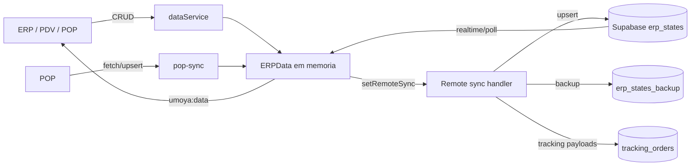
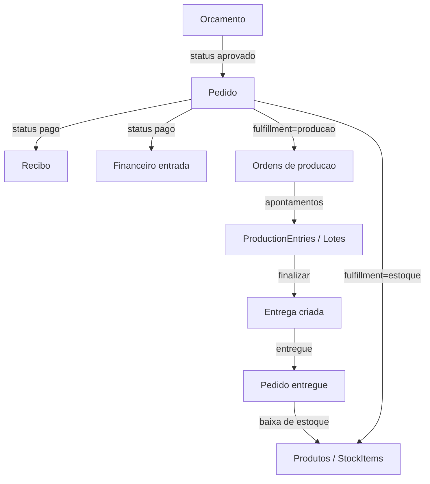
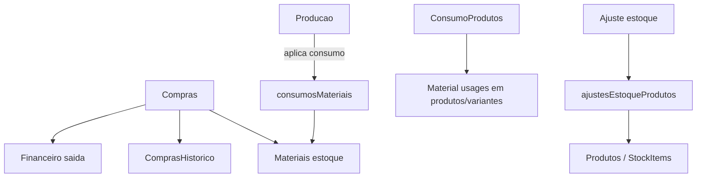
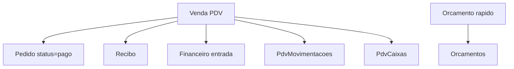
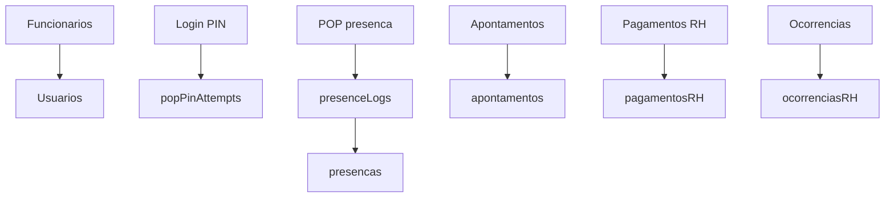
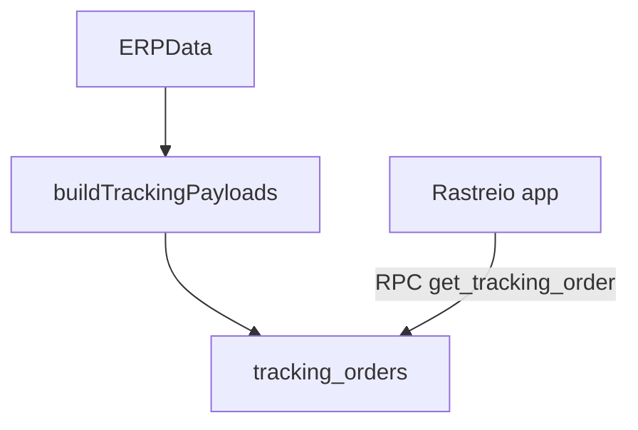

# Documentacao do sistema Umoya

## Escopo (apps)
- ERP (app principal): cadastros, vendas, producao, estoque, logistica, financeiro, RH, qualidade, relatorios, auditoria e configuracoes.
- PDV: venda rapida, orcamentos rapidos, caixa PDV e historico.
- POP: apontamento de producao e presenca por PIN em totem.
- PTC: painel tecnico (estado separado do ERP).
- PAS: painel de arquitetura (estado separado do ERP).
- Rastreio: portal publico de acompanhamento de pedidos.

## Armazenamento e sincronizacao
- Fonte de verdade local: `dataService` (`src/services/dataService.ts`) com `ERPData` em memoria.
- Observabilidade local: evento `umoya:data` atualiza `useERPData` (`src/store/appStore.ts`).
- Persistencia remota ERP: Supabase `erp_states` (upsert), backup em `erp_states_backup`.
- Rastreio: Supabase `tracking_orders` (payload gerado pelo ERP/PDV/POP).
- POP: sincroniza via funcao `pop-sync` (`src/services/popSyncRemote.ts`).
- PTC/PAS: estados proprios em `ptc_states` e `pas_states`.
- Auth: Supabase Auth (sessao local configuravel), dados de usuario em `ERPData.usuarios`.

### Fluxo macro de dados

## Modelo de dados (ERPData)
Tabela resumida de onde cada modulo escreve dados principais.

| Grupo | Tabelas (ERPData) | Modulos que escrevem |
| --- | --- | --- |
| Cadastros | `produtos`, `clientes`, `fornecedores`, `materiais`, `moldes`, `tabelas`, `empresa` | Cadastros, Configuracoes |
| Vendas | `orcamentos`, `pedidos`, `recibos` | Orcamentos, Pedidos, PDV |
| Producao | `ordensProducao`, `lotesProducao`, `productionEntries`, `refugosProducao` | Producao, ProducaoLotes, POP, ProducaoRefugo |
| Estoque | `ajustesEstoqueProdutos`, `stockItems` | Estoque, Pedidos (entrega), Producao (entrega) |
| Materiais | `consumosMateriais` | Producao (consumo automatico) |
| Compras | `comprasHistorico` | Compras |
| Logistica | `entregas` | Producao / ProducaoLotes (cria), Entregas (atualiza) |
| Financeiro | `financeiro`, `caixas`, `conferenciasCaixaFisico` | Financeiro, Compras, Pedidos, PDV |
| PDV | `pdvCaixas`, `pdvMovimentacoes` | PDV |
| RH | `funcionarios`, `cargos`, `niveis`, `apontamentos`, `presencas`, `presenceLogs`, `pagamentosRH`, `ocorrenciasRH`, `popPinAttempts` | RH, POP, Login |
| Qualidade | `qualidadeChecks`, `manutencoes` | Qualidade |
| Auditoria | `auditoria` | Varios modulos via `dataService.replaceAll` com `auditEvent` |
| Sistema | `usuarios`, `integracoes`, `sequences`, `meta` | Configuracoes, Login, RH |

## Fluxos principais (negocio e dados)

### Orcamento -> Pedido -> Producao -> Entrega -> Financeiro

Notas:
- Em `Orcamentos`, ao aprovar cria `pedidos` automaticamente com `status=aguardando_pagamento`.
- Em `Pedidos`, ao marcar `pago` gera `recibos` e `financeiro` e inicia `ordensProducao`.
- Ao finalizar producao, cria `entregas`. Ao entregar, o pedido pode ser marcado como `entregue`.

### Estoque, materiais e compras

### PDV (venda rapida)

### RH e POP

### Rastreio

## Modulos e responsabilidades (resumo)
- Cadastros: produtos, materiais, clientes, fornecedores, tabelas base.
- Vendas: orcamentos e pedidos; conversao e regras de pagamento/producoes.
- Producao: ordens, lotes, apontamentos e consumo de materiais.
- Estoque: ajustes manuais e visao de estoque por produto/material.
- Compras: entrada de materiais + saida financeira.
- Logistica: entregas e atualizacao de status de pedidos.
- Financeiro: entradas/saidas, caixas e conferencia de caixa.
- RH: funcionarios, presencas, apontamentos, pagamentos e ocorrencias.
- Qualidade: checks e manutencoes.
- Auditoria: log de acoes relevantes via `auditEvent`.

## Pontos de atencao (perda de dados)
- Sem Supabase configurado, o estado fica apenas em memoria e pode ser perdido ao recarregar.
- Sincronizacao remota depende de `workspaceId`; inconsistencias podem ocorrer se usuarios diferentes usam IDs distintos.
- POP usa `pop-sync` e pode ficar atrasado quando offline; sincroniza quando o endpoint responde.
- O backup em `erp_states_backup` roda com janela de tempo; falhas de rede podem atrasar snapshots.

## Checklist rapido de consistencia
- Orcamento aprovado gera pedido com `sourceQuoteId` e `status=aguardando_pagamento`.
- Pedido pago gera `recibos` e `financeiro` (entrada).
- Pedido em producao gera `ordensProducao`.
- Producao finalizada cria `entregas`.
- Entrega concluida marca pedido como `entregue` e baixa estoque.
- Compra aumenta estoque de materiais e gera saida no financeiro.
